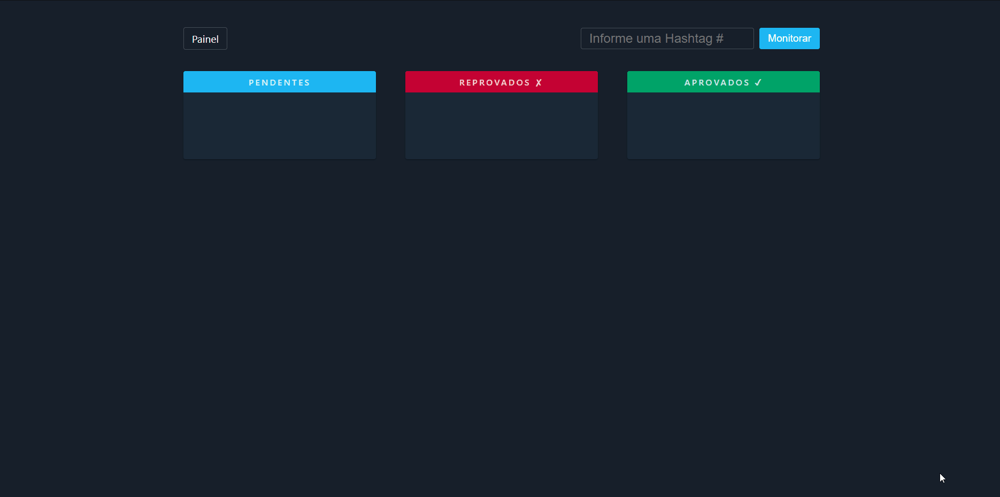

<div align="">
    <h1>Show Twitter Hashtag - FrontEnd</h1>
    Aplicativo para aprovação de tweets de uma determinada hashtag e visualização dos mesmos em um telão.
</div>
 

 

### Tela Controle

Tela onde são selecionados os tweets.

<div align="">
    
</div>

### Tela Painel

Tela onde mostra os tweets aprovados na tela de controle. 

<div align="">
    
</div>

## Sobre
### Desafio
Um diretor de TV precisa exibir em um telão, os tweets que chegam contendo uma determinada hashtag que varia diariamente. Foi pedido que esses tweets fossem inseridos no telão por um controle: Através de um sistema web que seria comandado pelo pessoal de operações do estúdio, neste caso o mesmo deveria aprovar os tweets que estão chegando para que o mesmo seja exibido. Para essa exibição, deverá obrigatoriamente ter efeito de transição entre os tweets que foram aprovados no sistema de controle.

### Funcionalidades
- Monitorar em tempo real tweets de uma hashtag.
- Aprovar ou reprovar tweets encontrados.
- Salvar no banco de dados todos os tweets encontrados.
- Visualizar em um telão os tweets aprovados.


### Importante
Para o funcionamento desse repositório é necessário fazer uso do seu BackEnd - [Show Twitter Hashtag - BackEnd](https://github.com/kaueemanuel/show-twitter-hashtag-backend).

## Intalaçao e Inicialização
### Instalação
#### Clonar o repositório:

```
git clone https://github.com/kaueemanuel/show-twitter-hashtag-frontend.git

cd show-twitter-hashtag-frontend
```

#### Dependências:

#### `npm install`
ou
#### `yarn` 

#### ENV:
Na raiz do projeto crie um arquivo `.env` e nele escreva a seguinte variável:
```
REACT_APP_SERVER=http://localhost:8888/
```
Obs.: Caso faça alteração da porta do servidor lembre-se de alterar nesse arquivo também.

### Inicialização
Para iniciar a aplicação certifique-se que o BackEnd esteja rodando [Show Twitter Hashtag - BackEnd](https://github.com/kaueemanuel/show-twitter-hashtag-backend).

#### `npm run start`
ou 
#### `yarn start` 

Após executar os comando se não abrir automaticamente o navegar, basta acessar: [http://localhost:3000](http://localhost:3000).


